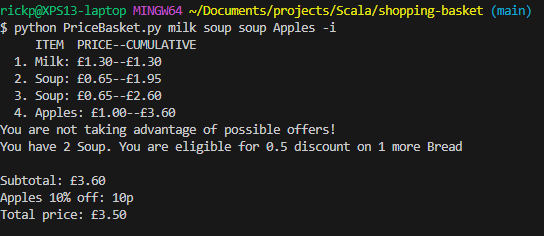

# Shopping Cart
Welcome to my Shopping Cart exercise solution in Scala.<br>

This ReadMe contains instructions on how to run the code in two seperate ways:
1. [Using JAR file](#Using-JAR-file) 
2. [Using Docker Desktop](#Using-Docker-Desktop) 
 
I advise using the JAR file as it is pre-compiled and runs substantially quicker,<br> 
but if you have any issue with that then try using Docker Desktop.

Additionally, there is the equivalent code in Python, which can be run using [these instructions](#Python-code)<br>
This has an additional and optional `-i` command line argument which prints the cumulative price of items.

# Using JAR file

### 1. Open a Command Line Interface (CLI) depending on your operating system
- Open Command Prompt (cmd) or PowerShell on Windows
- Open the Terminal on Mac/Linux

### 2. Ensure Java is installed
Make sure you have Java 8 JDK. To check; run `java -version` from the command line.<br>
If Java is not installed then please [download the JDK](https://www.oracle.com/java/technologies/downloads/#java8) and install.

### 3. Download the JAR File
Navigate to the 'Releases' section on the right hand side of the github project.
Download the <b>shopping-cart-1.0.0.jar</b> file.<br>

### 4.Navigate to the downloaded JAR location 
In your open CLI; use the `cd` command to navigate to the location of the downloaded jar file:<br>
``` sh
cd /directory/path/of/downloaded/shopping-cart-1.0.0.jar
```

### 5. Run Scala application
Run the following command:<br>
``` sh
java -jar target/scala-2.13/shopping-cart-1.0.0.jar Milk Apples Soup Bread`
```

Replace the path with your actual JAR file path and add any command-line arguments as needed.<br><br><br>

# Using Docker Desktop


### 1. Install Docker Desktop
[Download](https://www.docker.com/products/docker-desktop/) Docker Desktop if you do not already have it. Choose the relevant option for your operating system. 

### 2. Clone repo
You need to clone the repo from [github/RickPaddock/shopping-cart](https://github.com/RickPaddock/shopping-cart) using one of the following two ways:

#### a. Git clone
- Open a Command Line Interface (terminal)
- Check GIT installation by running `git --version`. If installed run:
```git clone https://github.com/RickPaddock/shopping-cart.git```<br>
```cd shopping-cart```<br>
This will download the latest code from the repository, & navigate into the project folder.

#### b. Manually clone by downloading

- Go to [github/RickPaddock/shopping-cart](https://github.com/RickPaddock/shopping-cart)
- Click the "Code" button (green) at the top right.
- Hit the “Download ZIP” buttong and extract the contents in your local.
- Open a Command Line Interface (CLI) and navigate to the folder where `build.sbt` resides. Something like:
  ```bash
  cd your/local/path/to/shopping-cart
  ```

### 3. Pull the Scala SBT Docker Image
Run the following to download the official Scala SBT docker image:<br>
```docker pull hseeberger/scala-sbt:8u222_1.3.5_2.13.1```

### 4. Run the Container (mounted)
This starts a container and maps the local repo into it:
```
docker run -it --rm --name scala-shopping-cart \
  --mount type=bind,source="$(pwd)",target="/home/shopping-basket" \
  hseeberger/scala-sbt:8u222_1.3.5_2.13.1
 ```
This uses the downloaded image to run the container in <b>interactive mode</b>.

### 5. Run the Scala Application
Once inside the container, navigate to `/home/shopping-basket` either by:<br>
`cd /home/shopping-basket`<br>
or<br>
`cd ../home/shopping-basket`<br>

Then run:

```
sbt 'runMain shop.PriceBasket milk Apples Bread Bread Soup Soup Soup Soup'
```

This executes the PriceBasket app inside the container.<br>
<i>Once you are finished, you can stop the container by hitting the stop button under actions in the Docker Desktop application.</i>
<br><br>


# Python code
This Python code is the same as the Scala version, but includes some extra data validation,<br>
and an additional (optional) `-i` command line argument which prints the cumulative price of items.<br><br>

For example:<br>


<br>
The following instructions can be followed to run the Python version of the PriceBasket:

### 1. Navigate to code
The code is in the same GitHub repo: [shopping-basket/PriceBasket.py](https://github.com/RickPaddock/shopping-cart/blob/main/shopping-basket/PriceBasket.py)

### 2. Run the code
The code can be run using one of the following two ways:

#### a. Local Python interpreter
If you already have Python installed, you use that. <br>
Alternatively you can download from the [official Python website](https://www.python.org/downloads/).

Once installed download the code (PriceBasket.py) from the repo, save to your local computer, and run using the following command:
```python
python PriceBasket.py milk
```
#### b. Online Python interpreter
If you have no local Python install, you can run using an online interpreter.<br>
Navigate to the python interpreter at [www.onlinegdb.com](https://www.onlinegdb.com/online_python_interpreter).<br>
Copy & Paste the code into the interpreter.<br>
Select the radio button 'Text' in the 'Standard Input' section towards the bottom.<br>
Add any command line arguments (such as Milk Soup etc).<br>
Hit the green run button at the top.<br>
Check the 'stdout' for the output or 'stderr' for any errors.<br>

